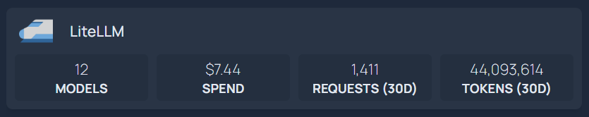

# LiteLLM

LiteLLM is a fast proxy to 100+ LLM APIs with unified interfaces (OpenAI, Anthropic, etc.).
This widget reads from the LiteLLM proxy admin API and shows up to **four fields of your choice**.

:::info
The `models` field works with any LiteLLM key. The other fields (`spend`, `budget`,
`requests`, `tokens`, `users`, `cache`, `failed`, `top_model`) require an
**admin/master key** — with a standard virtual key those blocks simply show `-`.
:::

## Fields

| Field       | Label          | Date filter | Description                                        |
| ----------- | -------------- | ----------- | -------------------------------------------------- |
| `models`    | Models         | ❌          | Number of available models (works with any key)    |
| `spend`     | Spend          | ❌          | Total spend across all time (USD)                  |
| `budget`    | Budget Used    | ❌          | Spend as a percentage of `max_budget` (admin)      |
| `requests`  | Requests (30d) | ✅          | API requests in the selected window                |
| `tokens`    | Tokens (30d)   | ✅          | Tokens in the selected window                      |
| `users`     | Users          | ❌          | Number of users (admin)                            |
| `cache`     | Cache Hit (30d)| ✅          | Cache hit ratio over the selected window           |
| `failed`    | Failed (30d)   | ✅          | Failed requests in the selected window             |
| `top_model` | Top Model      | ❌          | Highest-spending model (admin)                     |

Pick up to **four** fields via `widget.fields` — default is `["models", "spend", "requests", "tokens"]`.
Only the endpoints needed by the selected fields are fetched.

### Date filter

Fields marked ✅ are counted over a rolling window controlled by the `days` setting
(default **30**), and their label carries that window as a suffix — e.g. with
`days: 7` you see **Requests (7d)** and **Tokens (7d)**. Fields without the suffix
are **all-time** totals (the LiteLLM endpoints behind them, `/global/spend` and
`/global/spend/models`, do not accept a date range), which is why `spend`, `budget`
and `top_model` carry no suffix.

## Services Config

```yaml title="services.yaml"
services:
  LiteLLM:
    icon: litellm.png
    href: http://litellm.example.com:4000/ui
    widget:
      type: litellm
      url: http://litellm.example.com:4000
      key: sk-1234 # LiteLLM master (admin) key
      # days: 30 # optional window in days for requests/tokens/cache/failed (default 30)
      # fields: # optional, max 4 (default: models, spend, requests, tokens)
      #   - models
      #   - spend
      #   - budget
      #   - requests
      #   - tokens
      #   - users
      #   - cache
      #   - failed
      #   - top_model
```

The above configuration would result in something like this:


